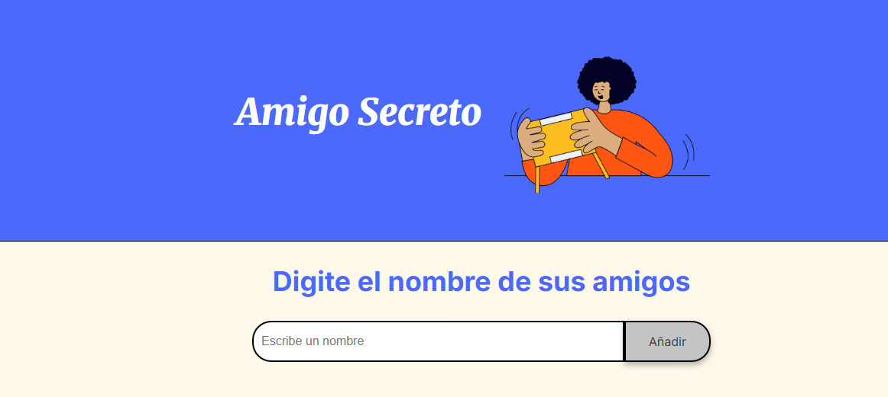
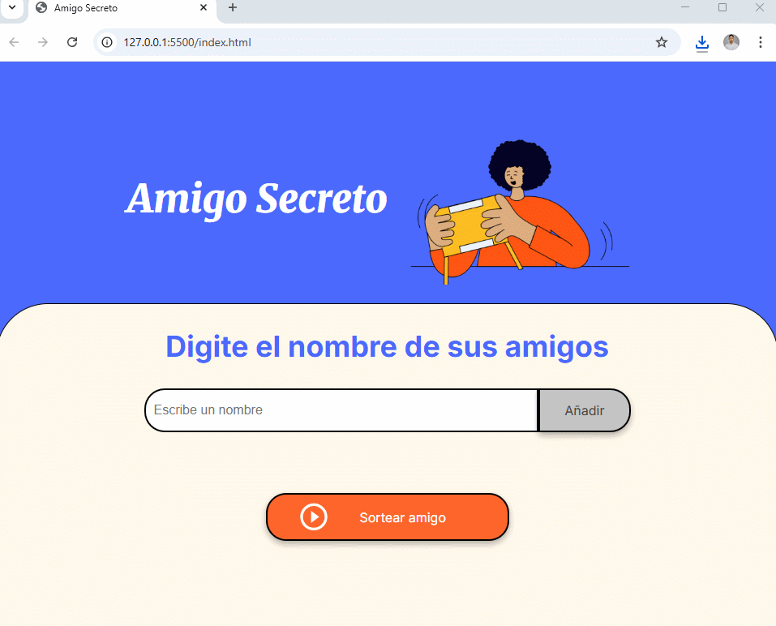

# 🎁 Oracle Challenge - Amigo Secreto

Una aplicación web interactiva para organizar tu **Amigo Secreto** de forma rápida, divertida y sin complicaciones.  
Agrega nombres, visualízalos en pantalla y deja que el azar elija quién será el afortunado.  



---

## ✨ Características

- 📋 **Agregar amigos** a la lista de forma sencilla.
- ✅ **Validación** para evitar campos vacíos.
- 👀 **Visualización instantánea** de todos los participantes.
- 🎲 **Sorteo aleatorio** con un solo clic.
- 📱 **Diseño responsive** para que funcione bien en móvil y PC.

---

## 📸 Vista previa


---

## 🚀 Cómo usarlo

1. **Escribe el nombre** de un amigo en el campo de texto.
2. Pulsa el botón **"Añadir"** para incorporarlo a la lista.
3. Repite hasta añadir a todos los participantes.
4. Haz clic en **"Sortear amigo"** y deja que el sistema elija por ti.

---

## 🛠️ Tecnologías utilizadas

- **HTML5** → Estructura del proyecto  
- **CSS3** → Estilos y diseño visual  
- **JavaScript (Vanilla)** → Lógica del sorteo y manejo del DOM  

---

## 📂 Estructura del proyecto
```plaintext
📦 Oracle-Challenge-Amigo-Secreto
┣ 📂 assets # Imágenes y recursos
┣ 📜 index.html # Estructura de la página
┣ 📜 style.css # Estilos del sitio
┣ 📜 app.js # Lógica del programa
┗ 📜 README.md # Documentación del proyecto
```


## — QuiliDev